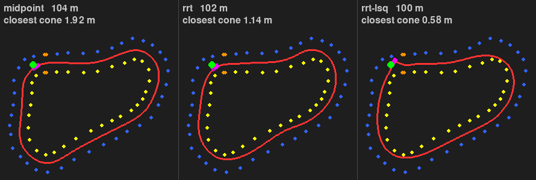
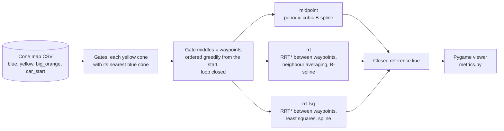
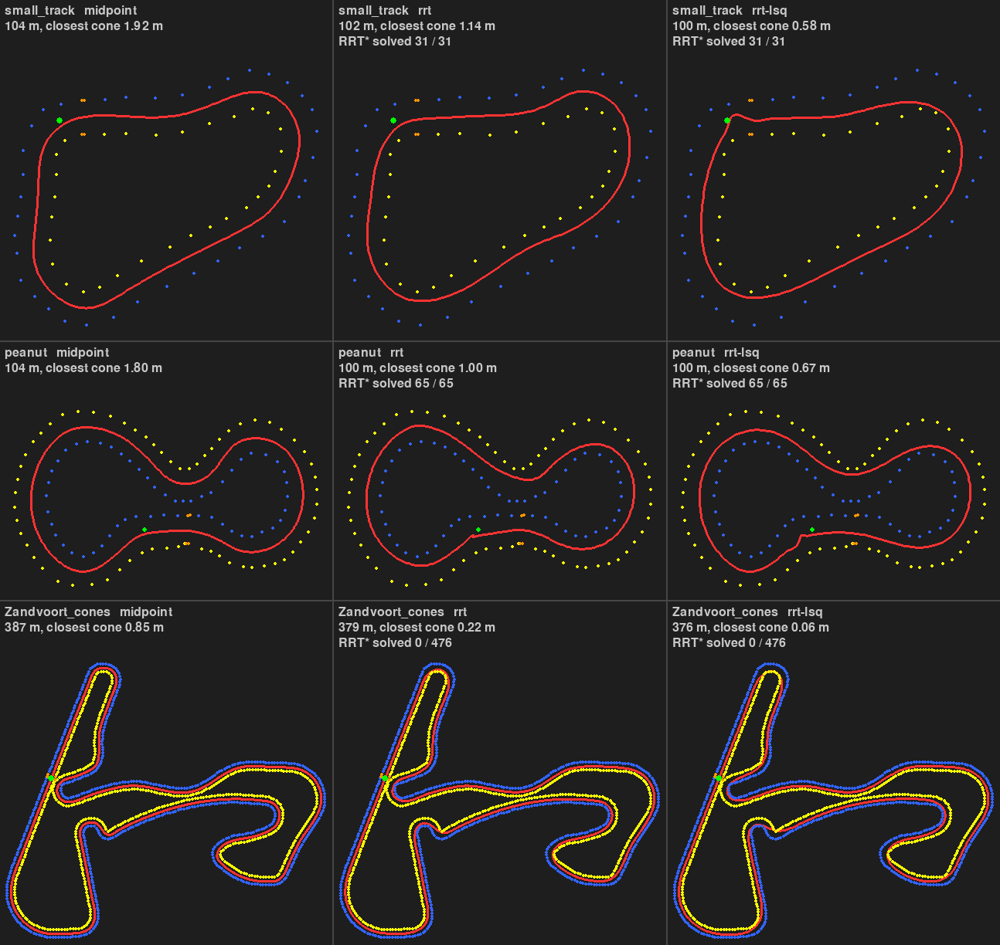

# PathPlanning - offline path planning on Formula Student cone tracks



*The three planners on `small_track`, same seed as the benchmark. The car moves at the same
constant speed along each line, so the shortest line finishes first. It is an animation of the
viewer, not a vehicle model. Recorded off-screen by `scripts/record_gif.py`.*

Given the full cone map of a track, three planners build a closed reference line around it, and a
Pygame viewer moves a car along that line. The code was written in November and December 2025 by
Guilhem Carmouze and two teammates as a sandbox for the driverless prototype of TLSe Racing
(Formula Student, 2025-2026 season). It is a team repository hosted on a personal account, not the
team's official software.

The planning is offline and global: the planners see every cone, so there is no perception here.
In October 2026 Guilhem Carmouze added what the sandbox lacked: a command line to choose the
planner and any of the 26 bundled tracks, measures of the planned lines, a benchmark whose results
are committed, tests and CI. The planners themselves were not changed.

## Status

| Part | Files | Written | State |
|---|---|---|---|
| Midpoint centre line, periodic cubic B-spline | `src/core/process_path.py` | Nov 2025, a teammate | Works on all 26 tracks, 0.2 s at most |
| RRT* between waypoints, neighbour averaging, B-spline (`rrt`) | `src/core/process_path_rrt.py` | Nov 2025, another teammate | Runs on all tracks, but finds paths only where the gates are wider than 2.4 m (3 of the 26 tracks); elsewhere every search ends in a straight segment (see Results) |
| Same RRT* front end, regularised least-squares smoothing (`rrt-lsq`; "QP" in the module) | `src/core/process_path_rrt_qp.py` | Nov 2025, another teammate | Same behaviour. It was not reachable from the menu before October 2026 |
| Pygame viewer, 2D camera (zoom about the cursor, pan, fullscreen) | `src/ui/` | Nov 2025, G. Carmouze | Works. The car steps one path sample per frame: an animation |
| CSV loader, world bounds, menu, the 26 cone maps in `data/` | `src/utils/`, `src/main.py`, `data/` | Nov 2025, G. Carmouze (menu shared with the two teammates) | Works; the origin of the maps is not documented |
| Command line, planner registry, metrics, benchmark, figures, tests, CI | `src/planners.py`, `src/metrics.py`, `scripts/`, `tests/` | Oct 2026, G. Carmouze | Reproduce every number and picture of this page |
| Perception, vehicle model, controller, speed profile, lap time, ROS | - | - | Not in this repository (a closed loop on a 2D simulator lives in [TLSe_Racing_Driverless](https://github.com/guilhem0908/TLSe_Racing_Driverless)) |

## How it works



All three planners build their waypoints the same way (the two RRT* modules repeat this step of
`process_path.py`): the middle of every yellow cone and its nearest blue cone is a waypoint, and
the waypoints are chained greedily from the start position. They differ in what happens between
and after the waypoints.

- **`midpoint`** fits a periodic cubic B-spline (`scipy.interpolate.splprep`, smoothing factor
  0.5) through the waypoints.
- **`rrt`** runs an RRT* search from each waypoint to the next one, with every cone as a disc of
  radius 1.2 m, 200 iterations, steps of 3 m and 5 % goal bias. A search that returns nothing is
  replaced by a straight segment. The result is thinned to one point per 1.5 m, smoothed by three
  passes of neighbour averaging and fitted with a periodic cubic spline.
- **`rrt-lsq`** has the same RRT* front end (10 % goal bias), then solves
  `min sum |P_i - R_i|^2 + lambda * sum |P_(i-1) - 2 P_i + P_(i+1)|^2` with `lambda = 5`, that is
  `(I + lambda D'D) P = R` with `D` the second-difference matrix, for x and y separately, and
  fits a spline through the result. The module calls this a QP, but it has no constraint: it is
  regularised least squares, and the second differences are taken on an open path, so the closing
  of the loop is not smoothed the same way as the rest.

Two measures are used to compare the lines (`src/metrics.py`). The path is sampled every 0.1 m,
and then the **closest approach** is the smallest distance from a sample to the centre of any
cone. The **share between the rows** is the fraction of samples whose nearest blue cone and
nearest yellow cone lie on opposite sides of them, which a line that cuts across the infield or
leaves the track does not satisfy.

## Results

`scripts/benchmark.py` runs the three planners on the 26 bundled tracks with the Python random
generator seeded at 0, 78 runs in all. The raw results are in `results/` (`benchmark.json`,
`benchmark.csv`, `benchmark.md`) and the tables below are copied from there by the script.



*Three of the 26 tracks, drawn by `scripts/render_planners.py`. Bottom row: on a circuit-shaped
map no RRT* search returns a path, and the smoothed line then passes a few centimetres from cones.*

<!-- benchmark:begin (written by scripts/benchmark.py) -->

#### Summary over 26 tracks

| Planner | Median planning time (ms) | Slowest track (s) | Median min clearance (m) | Worst min clearance (m) | Tracks with clearance below 0.7 m | Lowest share between the rows (%) | RRT* segments solved |
|---|---|---|---|---|---|---|---|
| midpoint | 63 | 0.2 | 0.94 | 0.48 | 6 / 26 | 99.5 | - |
| rrt | 27731 | 58.8 | 0.15 | 0.01 | 23 / 26 | 99.5 | 585 / 11998 (5 %) |
| rrt-lsq | 34124 | 73.1 | 0.04 | 0.01 | 25 / 26 | 97.4 | 585 / 11998 (5 %) |

#### The three tracks of the original menu

| Track | Width (m) | Planner | Planning time (ms) | Path length (m) | Min clearance (m) | Between the rows (%) | RRT* segments solved |
|---|---|---|---|---|---|---|---|
| `small_track` | 4.77 | midpoint | 1.2 | 104.1 | 1.92 | 99.5 | - |
| `small_track` | 4.77 | rrt | 82 | 101.5 | 1.14 | 99.5 | 31 / 31 (100 %) |
| `small_track` | 4.77 | rrt-lsq | 109 | 100.1 | 0.58 | 99.5 | 31 / 31 (100 %) |
| `hairpins_increasing_difficulty` | 3.00 | midpoint | 32 | 831.4 | 0.98 | 100.0 | - |
| `hairpins_increasing_difficulty` | 3.00 | rrt | 1434 | 815.4 | 0.16 | 100.0 | 489 / 491 (100 %) |
| `hairpins_increasing_difficulty` | 3.00 | rrt-lsq | 1472 | 812.2 | 0.13 | 100.0 | 489 / 491 (100 %) |
| `peanut` | 4.19 | midpoint | 2.5 | 103.8 | 1.80 | 100.0 | - |
| `peanut` | 4.19 | rrt | 47 | 99.8 | 1.00 | 100.0 | 65 / 65 (100 %) |
| `peanut` | 4.19 | rrt-lsq | 45 | 99.6 | 0.67 | 100.0 | 65 / 65 (100 %) |

<details>
<summary>All 78 runs</summary>

| Track | Width (m) | Planner | Planning time (ms) | Path length (m) | Min clearance (m) | Between the rows (%) | RRT* segments solved |
|---|---|---|---|---|---|---|---|
| `small_track` | 4.77 | midpoint | 1.2 | 104.1 | 1.92 | 99.5 | - |
| `small_track` | 4.77 | rrt | 82 | 101.5 | 1.14 | 99.5 | 31 / 31 (100 %) |
| `small_track` | 4.77 | rrt-lsq | 109 | 100.1 | 0.58 | 99.5 | 31 / 31 (100 %) |
| `hairpins_increasing_difficulty` | 3.00 | midpoint | 32 | 831.4 | 0.98 | 100.0 | - |
| `hairpins_increasing_difficulty` | 3.00 | rrt | 1434 | 815.4 | 0.16 | 100.0 | 489 / 491 (100 %) |
| `hairpins_increasing_difficulty` | 3.00 | rrt-lsq | 1472 | 812.2 | 0.13 | 100.0 | 489 / 491 (100 %) |
| `peanut` | 4.19 | midpoint | 2.5 | 103.8 | 1.80 | 100.0 | - |
| `peanut` | 4.19 | rrt | 47 | 99.8 | 1.00 | 100.0 | 65 / 65 (100 %) |
| `peanut` | 4.19 | rrt-lsq | 45 | 99.6 | 0.67 | 100.0 | 65 / 65 (100 %) |
| `Austin_cones` | 2.21 | midpoint | 42 | 420.1 | 0.98 | 100.0 | - |
| `Austin_cones` | 2.21 | rrt | 33739 | 408.1 | 0.08 | 100.0 | 0 / 534 (0 %) |
| `Austin_cones` | 2.21 | rrt-lsq | 39801 | 402.8 | 0.03 | 99.6 | 0 / 534 (0 %) |
| `BrandsHatch_cones` | 2.21 | midpoint | 26 | 356.0 | 0.99 | 100.0 | - |
| `BrandsHatch_cones` | 2.21 | rrt | 23175 | 351.5 | 0.35 | 100.0 | 0 / 436 (0 %) |
| `BrandsHatch_cones` | 2.21 | rrt-lsq | 28508 | 350.5 | 0.02 | 99.9 | 0 / 436 (0 %) |
| `Budapest_cones` | 2.21 | midpoint | 67 | 402.0 | 0.98 | 100.0 | - |
| `Budapest_cones` | 2.21 | rrt | 29778 | 394.1 | 0.27 | 100.0 | 0 / 494 (0 %) |
| `Budapest_cones` | 2.21 | rrt-lsq | 32253 | 391.1 | 0.06 | 99.8 | 0 / 494 (0 %) |
| `Catalunya_cones` | 2.20 | midpoint | 82 | 416.1 | 0.84 | 100.0 | - |
| `Catalunya_cones` | 2.20 | rrt | 27748 | 407.9 | 0.14 | 100.0 | 0 / 512 (0 %) |
| `Catalunya_cones` | 2.20 | rrt-lsq | 32658 | 404.9 | 0.04 | 99.9 | 0 / 512 (0 %) |
| `Hockenheim_cones` | 2.21 | midpoint | 46 | 358.5 | 0.55 | 100.0 | - |
| `Hockenheim_cones` | 2.21 | rrt | 21848 | 349.5 | 0.07 | 99.9 | 0 / 441 (0 %) |
| `Hockenheim_cones` | 2.21 | rrt-lsq | 25356 | 346.3 | 0.01 | 99.6 | 0 / 441 (0 %) |
| `IMS_cones` | 2.21 | midpoint | 36 | 293.0 | 0.99 | 100.0 | - |
| `IMS_cones` | 2.21 | rrt | 15785 | 292.5 | 0.89 | 100.0 | 0 / 375 (0 %) |
| `IMS_cones` | 2.21 | rrt-lsq | 18114 | 292.9 | 1.01 | 100.0 | 0 / 375 (0 %) |
| `Melbourne_cones` | 2.21 | midpoint | 89 | 473.3 | 0.89 | 100.0 | - |
| `Melbourne_cones` | 2.21 | rrt | 45994 | 466.3 | 0.21 | 100.0 | 0 / 584 (0 %) |
| `Melbourne_cones` | 2.21 | rrt-lsq | 58133 | 463.6 | 0.04 | 99.9 | 0 / 584 (0 %) |
| `MexicoCity_cones` | 2.20 | midpoint | 51 | 355.0 | 0.78 | 100.0 | - |
| `MexicoCity_cones` | 2.20 | rrt | 27047 | 345.6 | 0.09 | 99.9 | 0 / 438 (0 %) |
| `MexicoCity_cones` | 2.20 | rrt-lsq | 35591 | 341.3 | 0.05 | 98.5 | 0 / 438 (0 %) |
| `Montreal_cones` | 2.21 | midpoint | 48 | 283.3 | 0.59 | 100.0 | - |
| `Montreal_cones` | 2.21 | rrt | 19776 | 274.0 | 0.03 | 100.0 | 0 / 348 (0 %) |
| `Montreal_cones` | 2.21 | rrt-lsq | 23147 | 270.4 | 0.08 | 99.5 | 0 / 348 (0 %) |
| `Monza_cones` | 2.20 | midpoint | 100 | 445.2 | 0.63 | 100.0 | - |
| `Monza_cones` | 2.20 | rrt | 58788 | 441.0 | 0.18 | 99.9 | 0 / 549 (0 %) |
| `Monza_cones` | 2.20 | rrt-lsq | 73140 | 439.9 | 0.05 | 99.9 | 0 / 549 (0 %) |
| `MoscowRaceway_cones` | 2.22 | midpoint | 171 | 321.9 | 1.00 | 100.0 | - |
| `MoscowRaceway_cones` | 2.22 | rrt | 35068 | 310.8 | 0.21 | 100.0 | 0 / 412 (0 %) |
| `MoscowRaceway_cones` | 2.22 | rrt-lsq | 40717 | 305.0 | 0.02 | 98.7 | 0 / 412 (0 %) |
| `Nuerburgring_cones` | 2.21 | midpoint | 97 | 445.4 | 0.96 | 100.0 | - |
| `Nuerburgring_cones` | 2.21 | rrt | 53651 | 434.8 | 0.12 | 99.7 | 0 / 549 (0 %) |
| `Nuerburgring_cones` | 2.21 | rrt-lsq | 52784 | 429.8 | 0.03 | 98.7 | 0 / 549 (0 %) |
| `Oschersleben_cones` | 2.21 | midpoint | 50 | 260.0 | 0.92 | 100.0 | - |
| `Oschersleben_cones` | 2.21 | rrt | 14838 | 251.3 | 0.24 | 100.0 | 0 / 317 (0 %) |
| `Oschersleben_cones` | 2.21 | rrt-lsq | 17522 | 246.8 | 0.02 | 97.4 | 0 / 317 (0 %) |
| `Sakhir_cones` | 2.21 | midpoint | 109 | 440.3 | 0.71 | 100.0 | - |
| `Sakhir_cones` | 2.21 | rrt | 37140 | 429.9 | 0.02 | 99.8 | 0 / 544 (0 %) |
| `Sakhir_cones` | 2.21 | rrt-lsq | 42294 | 426.3 | 0.03 | 98.9 | 0 / 544 (0 %) |
| `SaoPaulo_cones` | 2.21 | midpoint | 58 | 344.1 | 0.96 | 100.0 | - |
| `SaoPaulo_cones` | 2.21 | rrt | 22983 | 336.5 | 0.14 | 100.0 | 0 / 439 (0 %) |
| `SaoPaulo_cones` | 2.21 | rrt-lsq | 29644 | 333.5 | 0.04 | 98.9 | 0 / 439 (0 %) |
| `Sepang_cones` | 2.21 | midpoint | 107 | 486.4 | 0.98 | 100.0 | - |
| `Sepang_cones` | 2.21 | rrt | 44204 | 476.5 | 0.19 | 100.0 | 0 / 600 (0 %) |
| `Sepang_cones` | 2.21 | rrt-lsq | 47282 | 472.1 | 0.02 | 99.4 | 0 / 600 (0 %) |
| `Shanghai_cones` | 2.20 | midpoint | 89 | 496.4 | 0.48 | 100.0 | - |
| `Shanghai_cones` | 2.20 | rrt | 42073 | 484.4 | 0.01 | 99.7 | 0 / 615 (0 %) |
| `Shanghai_cones` | 2.20 | rrt-lsq | 46960 | 479.7 | 0.02 | 98.8 | 0 / 615 (0 %) |
| `Silverstone_cones` | 2.21 | midpoint | 86 | 457.4 | 0.98 | 100.0 | - |
| `Silverstone_cones` | 2.21 | rrt | 34622 | 449.5 | 0.21 | 100.0 | 0 / 563 (0 %) |
| `Silverstone_cones` | 2.21 | rrt-lsq | 41006 | 445.4 | 0.01 | 99.8 | 0 / 563 (0 %) |
| `Sochi_cones` | 2.21 | midpoint | 73 | 462.5 | 0.72 | 100.0 | - |
| `Sochi_cones` | 2.21 | rrt | 38195 | 454.2 | 0.04 | 100.0 | 0 / 571 (0 %) |
| `Sochi_cones` | 2.21 | rrt-lsq | 41395 | 451.4 | 0.03 | 99.4 | 0 / 571 (0 %) |
| `Spa_cones` | 2.21 | midpoint | 107 | 553.9 | 0.95 | 100.0 | - |
| `Spa_cones` | 2.21 | rrt | 49706 | 544.0 | 0.02 | 99.8 | 0 / 685 (0 %) |
| `Spa_cones` | 2.21 | rrt-lsq | 55341 | 540.0 | 0.04 | 99.4 | 0 / 685 (0 %) |
| `Spielberg_cones` | 2.21 | midpoint | 48 | 342.2 | 0.57 | 100.0 | - |
| `Spielberg_cones` | 2.21 | rrt | 18256 | 337.0 | 0.05 | 100.0 | 0 / 421 (0 %) |
| `Spielberg_cones` | 2.21 | rrt-lsq | 22208 | 335.8 | 0.03 | 99.6 | 0 / 421 (0 %) |
| `YasMarina_cones` | 2.22 | midpoint | 64 | 396.4 | 0.67 | 100.0 | - |
| `YasMarina_cones` | 2.22 | rrt | 27287 | 382.6 | 0.04 | 99.8 | 0 / 508 (0 %) |
| `YasMarina_cones` | 2.22 | rrt-lsq | 35985 | 377.9 | 0.04 | 98.5 | 0 / 508 (0 %) |
| `Zandvoort_cones` | 2.21 | midpoint | 61 | 387.3 | 0.85 | 100.0 | - |
| `Zandvoort_cones` | 2.21 | rrt | 27714 | 379.4 | 0.22 | 100.0 | 0 / 476 (0 %) |
| `Zandvoort_cones` | 2.21 | rrt-lsq | 32524 | 376.0 | 0.06 | 99.7 | 0 / 476 (0 %) |

</details>

Seed 0 for every run. Width is the median distance from a blue cone to the nearest yellow cone. Computing time: 1627 s summed over the runs, 547 s wall clock with 3 processes (Python 3.14.2, NumPy 2.3.5, SciPy 1.17.1, Windows AMD64, 32 logical CPUs, no GPU). The planning times were taken while the runs shared the machine, so they are indicative.

<!-- benchmark:end -->

What the tables say:

- **`midpoint` is fast and keeps its distance.** Median planning time 63 ms, 0.2 s at most. Its
  median closest approach is 0.94 m. On 6 of the 26 tracks it passes closer than 0.7 m to a cone
  centre (half the width of a 1.4 m car, an assumption), 0.48 m at worst, on `Shanghai_cones`.
- **The RRT* planners solve only the three tracks of the original menu.** Of 11,998 searches,
  585 returned a path: 31 of 31 on `small_track`, 489 of 491 on `hairpins_increasing_difficulty`,
  65 of 65 on `peanut`. On the 23 circuit-shaped maps, none of 11,411.
- **Why.** Every cone is a disc of radius 1.2 m, so the middle of a gate narrower than 2.4 m lies
  inside the discs of its own two cones and the goal of the search is in collision. The three
  original tracks have gates of 2.96 m and more; on the 23 other maps the median distance from a
  blue cone to the nearest yellow cone is 2.20 to 2.22 m. A test (`tests/test_planners.py`) shows the threshold on a synthetic ring: every
  segment is solved with 2.6 m gates and none with 2.2 m gates.
- **What `rrt` and `rrt-lsq` then are.** A chain of straight segments between the same waypoints
  as `midpoint`, smoothed without any knowledge of the cones. On the 23 circuit maps their median
  closest approach is 0.14 m for `rrt` and 0.03 m for `rrt-lsq`, and 22 of the 23 lines pass closer
  than 0.7 m to a cone. They also take 30 s and 36 s (median) against 0.1 s.
- **On the tracks where RRT* works** the lines are shorter than `midpoint` (100.1 m against
  104.1 m on `small_track`, 812.2 m against 831.4 m on the hairpin track, for `rrt-lsq`) but
  closer to the cones: 0.58 m against 1.92 m on `small_track`, and 0.13 m against 0.98 m on the
  hairpin track.
- **Staying between the rows is not the issue.** The lowest share is 99.5 % for `midpoint` and
  `rrt` and 97.4 % for `rrt-lsq`.

What they do not say: there is no ground-truth best line, no vehicle model and no measure of
drivability, so a larger closest approach is not a faster lap. The timings come from one machine
that was running other jobs. RRT* is random and the committed numbers are those of seed 0.

## Quickstart

Python 3.12 or newer (developed with 3.14, CI runs 3.12).

```bash
git clone https://github.com/guilhem0908/PathPlanning.git
cd PathPlanning
python -m venv .venv
source .venv/bin/activate          # Windows: .venv\Scripts\activate
pip install -r requirements.txt

python src/main.py --list                                      # tracks and planners
python src/main.py --track small_track --planner midpoint      # opens the viewer
python src/main.py --track hairpins_increasing_difficulty --planner rrt --seed 0
python src/main.py --track spa --planner midpoint --no-window  # prints the figures only
python src/main.py                                             # menu of the 26 tracks, rrt
```

Viewer controls: mouse wheel zooms about the cursor, left-drag pans, arrow keys change the size
of cones and car, `R` resets, `F11` toggles fullscreen, `ESC` quits. Without `--planner`, `rrt`
is used, as before; on a circuit-shaped map it took 15 s to 59 s in the benchmark.

Tests and regeneration of the results:

```bash
pip install -r requirements-dev.txt
pytest                                   # no window is opened
ruff check .
python scripts/benchmark.py --jobs 3     # 78 runs, 547 s on the author's machine; rewrites results/ and the tables above
python scripts/render_planners.py        # rewrites docs/planners.png
python scripts/record_gif.py             # rewrites docs/planners.gif, needs ffmpeg on the PATH
```

`pytest` includes a check that the tables of this page are the committed `results/benchmark.md`.
`python scripts/benchmark.py --quick` runs only the three tracks of the original menu, in seconds.

## Limitations

- Offline and global: the planners know every cone. There is no perception, no vehicle model, no
  controller and no speed profile, and no lap time is measured. The car of the viewer is moved one
  path sample per frame.
- On the RRT* planners, beyond the gate-width limit above: the random samples of both
  coordinates are drawn from the x-range of the cones (`rand_area` is built from x only), and a
  search returns as soon as it reaches its goal, so the optimising part of RRT* does not come
  into play.
- The smoothing steps of `rrt` and `rrt-lsq` do not look at the cones, which is why their lines
  can pass within centimetres of one.
- The "QP" of `rrt-lsq` is unconstrained regularised least squares, as described above.
- Blue and yellow are assumed to be the two edges of the track and the start cone gives the
  starting position; the `direction` column of the CSV files is not used.
- The origin of the cone maps is not documented. No licence has been chosen for this repository.

## Repository layout

```
src/main.py            command line and menu
src/planners.py        names the three planners and runs any of them (October 2026)
src/metrics.py         length, closest approach, share between the rows (October 2026)
src/core/              the three planning modules, as their authors committed them
src/ui/                viewer, camera, off-screen panel used by the figures
src/utils/             CSV loader, track catalogue
data/                  26 cone maps (CSV)
scripts/               benchmark, figure and GIF scripts
tests/                 pytest suite
results/               benchmark output
docs/                  figure and GIF
README.fr.md           the original French note, kept as written
```

## Authors and credits

Who wrote what, by `git blame` at the last commit of 2025 (`8bf44a2`), in lines of Python. The
names of the two teammates are in the commit history.

| Author | Lines | Where |
|---|---|---|
| A teammate (RRT* planners) | 634 | `src/core/process_path_rrt.py` (330), `src/core/process_path_rrt_qp.py` (297), 7 lines of `src/main.py`; also the original French note |
| Guilhem Carmouze | 355 | `src/ui/process_pygame.py` (196), `src/ui/camera.py` (55), `src/utils/track_utils.py` (68), 31 lines of `src/main.py`, 5 lines of `src/core/process_path.py` |
| A teammate (midpoint planner) | 146 | `src/core/process_path.py` (116), 30 lines of `src/main.py` |

Everything added in October 2026 (`src/planners.py`, `src/metrics.py`, `src/ui/offscreen.py`, the
rewritten `src/main.py`, the split of the viewer's drawing from its event loop, `scripts/`,
`tests/`, CI, this page) is by Guilhem Carmouze, written with AI coding assistance; those
commits carry a `Co-Authored-By` trailer. The planning modules in `src/core/` are untouched.

Tools: [NumPy](https://numpy.org), [SciPy](https://scipy.org), [pygame-ce](https://pyga.me),
[ffmpeg](https://ffmpeg.org) for the GIF. RRT*: S. Karaman and E. Frazzoli, "Sampling-based
algorithms for optimal motion planning", International Journal of Robotics Research, 2011.

Related repository from the same period:
[TLSe_Racing_Driverless](https://github.com/guilhem0908/TLSe_Racing_Driverless), the 2D simulator
with the field-of-view sensor model and a closed loop that drives laps.
